# openclaw-statusbar

Live Telegram statusline plugin for OpenClaw.

[](./CHANGELOG.md)
[](https://github.com/openclaw/openclaw)
[](https://telegram.org/)
[](https://www.typescriptlang.org/)
[](./LICENSE)

`openclaw-statusbar` adds a live run status message to Telegram chats used by OpenClaw agents.

- Works in DM and groups/topics
- Supports pinned mode or new-message-per-run mode
- Uses one live-updated message per run target
- Tracks queue/tool/run phases with predictive progress + ETA

## Preview



Current default template (`tiny1`, predictive mode):

```text
⚡ RUNNING #12 | thinking | 00:43 | 2/4 | 62% | ETA 00:26
```

During tool execution:

```text
🛠️ TOOL #12 | exec | 00:43 | 2/4 | 62% | ETA 00:26
```

## Features

- Live phases: `QUEUED`, `RUNNING`, `TOOL`, `DONE`, `ERROR`
- Per-chat persistence for settings and message references
- Predictive progress mode (`steps`, `%`, `ETA`) based on historical runs
- Pin/unpin workflow:
  - pinned: same message is updated across runs
  - unpinned: new status message per run
- Robust Telegram delivery:
  - Global circuit breaker — blocks all requests to `(account, chat)` after a 429
  - Adaptive phase throttle — TOOL=2000ms, RUNNING=throttleMs, QUEUED=throttleMs×2
  - Fetch timeouts — 10s edit, 15s send/pin (prevents hangs on slow networks)
  - Urgent flush — bypass throttle for phase changes (immediate UI feedback)
  - Smart retry/backoff — 0 retries for edits (ephemeral), N retries for send/pin (critical)
  - Recovery on deleted status message (`message to edit not found`)
- Hot-reload ready — proper teardown via `destroy()` method
- Memory-safe — automatic cleanup of stale sessions after 2h inactivity

## Commands

| Command | Description |
| --- | --- |
| `/sbon` | Enable statusline in current chat |
| `/sboff` | Disable statusline in current chat |
| `/sbstatus` | Show mapping + runtime/debug values |
| `/sbreset` | Reset status message reference and recreate it |
| `/sbpin` | Enable pinned behavior for current chat |
| `/sbunpin` | Disable pinned behavior (new message per run) |
| `/sbmode minimal\|normal\|detailed` | Compatibility option (no visual difference in `tiny1`) |
| `/sbsettings` | Show current settings and command help |

## Install

### CLI install

```bash
openclaw plugins install -l ~/openclaw-statusbar
openclaw plugins enable telegram
openclaw plugins enable openclaw-statusbar
openclaw gateway --force
```

### Manual config (optional)

Path: `plugins.entries.openclaw-statusbar.config`

```json
{
  "plugins": {
    "entries": {
      "openclaw-statusbar": {
        "enabled": true,
        "config": {
          "enabledByDefault": false,
          "defaultLayout": "tiny1",
          "defaultProgressMode": "predictive"
        }
      }
    }
  }
}
```

## Configuration

Path: `plugins.entries.openclaw-statusbar.config`

| Key | Type | Default | Description |
| --- | --- | --- | --- |
| `enabledByDefault` | `boolean` | `false` | Default enable state for new chats |
| `defaultMode` | `minimal \| normal \| detailed` | `normal` | Compatibility mode field |
| `defaultLayout` | `tiny1` | `tiny1` | Default render layout |
| `defaultProgressMode` | `strict \| predictive` | `predictive` | Progress strategy |
| `throttleMs` | `number` | `4000` | Base edit throttle (raised to avoid 429 rate limits) |
| `minThrottleMs` | `number` | `2500` | Minimum throttle floor |
| `liveTickMs` | `number` | `2500` | Live ticker interval |
| `maxRetriesEdit` | `number` | `0` | Retries for `editMessageText` (ephemeral, 0 recommended) |
| `maxRetriesSend` | `number` | `4` | Retries for `sendMessage`/`pinChatMessage` (critical) |
| `autoHideSeconds` | `number` | `0` | Auto-hide after completion (`0` disables) |
| `showInlineControls` | `boolean` | `false` | Reserved (inline controls disabled) |
| `newMessagePerRun` | `boolean` | `true` | Create a new status message at each run start (unless pinned) |

## Progress Modes

### `strict`

- Never guesses total steps
- Shows safe values only
- Example while running:

```text
⚡ RUNNING #21 | thinking | 00:20 | 2/? | -- | ETA --
```

### `predictive`

- Estimates total steps and ETA from conversation history
- Updates estimates as runs complete
- Example while running:

```text
⚡ RUNNING #21 | thinking | 00:20 | 2/4 | 50% | ETA 00:22
```

## Templates

### Built-in templates

- `tiny1` (default): compact single-line statusline

### Template catalog (ready to copy as custom layouts)

These are design blueprints (not all are built-in yet):

#### Tiny

1. `tiny1`: `⚡ RUNNING #12 | thinking | 00:43 | 2/4 | 62% | ETA 00:26`
2. `tiny2`: `🛠️ TOOL #12 | exec | 00:43 | 2/? | 40% | ETA 00:39`
3. `tiny3`: `⏳ QUEUED #12 | queue | 00:03 | 0/4 | 5% | ETA 01:08`
4. `tiny4`: `✅ DONE #12 | done | 01:18 | 4/4 | 100% | ETA 00:00`
5. `tiny5`: `❌ ERROR #12 | exec | 00:37 | 2/4 | 50% | ETA --`

#### Medium

1.
```text
⚡ RUNNING • Task #12
Progress 2/4 • 62% • ETA 00:26
```
2.
```text
🛠️ TOOL • Task #12
Tool exec • 2/? • 40% • ETA 00:39
```
3.
```text
⏳ QUEUED • Task #12
Queue 1 • 0/4 • 5% • ETA 01:08
```
4.
```text
✅ DONE • Task #12
4/4 • 100% • Total 01:18
```
5.
```text
❌ ERROR • Task #12
2/4 • 50% • Elapsed 00:37
```

#### Rich

1.
```text
⚡ RUNNING • Task #12 📌
State: thinking
Tool: -
Progress: 2/4 • 62%
Elapsed: 00:43 • ETA: 00:26
```
2.
```text
🛠️ TOOL • Task #12
State: tool_running
Tool: exec
Progress: 2/? • 40%
Elapsed: 00:43 • ETA: 00:39
```
3.
```text
⏳ QUEUED • Task #12
State: queued
Queue: 1
Progress: 0/4 • 5%
Elapsed: 00:03 • ETA: 01:08
```
4.
```text
✅ DONE • Task #12
State: complete
Progress: 4/4 • 100%
Elapsed: 01:18 • ETA: 00:00
```
5.
```text
❌ ERROR • Task #12
State: failed
Tool: exec
Progress: 2/4 • 50%
Elapsed: 00:37 • ETA: --
```

## Custom Templates

To add your own layout:

1. Add a new layout id in `src/types.ts`:
   - extend `StatusLayout` (for example: `"tiny2"`)
2. Add parsing support in `src/config.ts`:
   - update `asLayout(...)`
3. Expose it in `openclaw.plugin.json`:
   - update `defaultLayout` enum
4. Implement renderer in `src/render.ts`:
   - create `renderTiny2(...)`
   - route it from `renderStatusText(...)`
5. Restart gateway:
   - `openclaw gateway --force`

Tip: keep template rendering pure (no side effects), and keep step/ETA calculation logic centralized.

## Runtime Notes

- If the bot cannot pin messages (missing admin permission in group), statusline still works, but pin command will only switch internal mode.
- If status message is deleted manually, plugin recreates it automatically.
- If webhook/polling conflicts exist in Telegram, fix webhook on the bot token before testing.
- Sessions are automatically cleaned up after 2 hours of inactivity to prevent memory leaks.
- Plugin supports hot-reload via proper `destroy()` teardown.

## Development

```bash
npm install
npm run typecheck
```

## Changelog

See [CHANGELOG.md](./CHANGELOG.md) for version history and release notes.

## License

MIT
