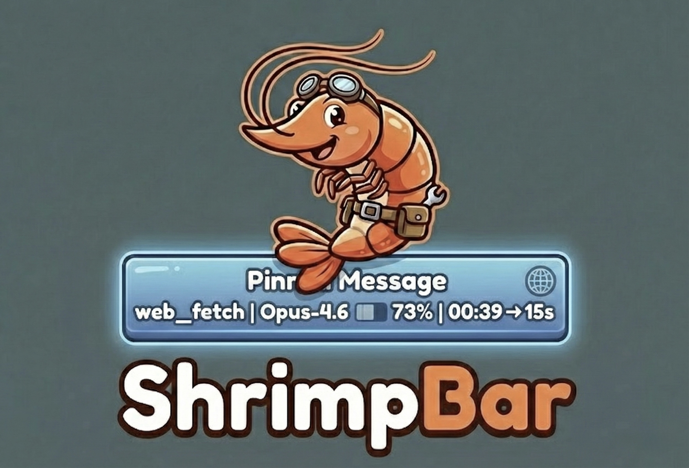

<p align="center">
  
</p>

# ShrimpBar — openclaw-statusbar

```
🖥 exec │ ████░░░ 52% │ 00:15→13s
🟢 done │ opus-4.6|High │ 00:31s │ 1.5k↑340↓
```

> A live status bar for your AI agent, pinned right inside Telegram.  
> See what Claude is doing, how long it's been thinking, and when it'll finish — in real time.

[](./CHANGELOG.md)
[](https://github.com/openclaw/openclaw)
[](https://telegram.org/)
[](https://www.typescriptlang.org/)
[](./LICENSE)
[](https://sacred-virtue-xvnk.here.now/)

---

## What it does

When your OpenClaw agent starts working, a live message appears (or updates, if pinned) in Telegram showing:

- **Phase icon** — unique emoji per tool (🖥 exec, 🔍 web_search, 📖 Read, 💬 message…)
- **Progress bar** — estimated completion (predictive, based on history)
- **Elapsed time** — how long the agent has been running
- **ETA** — predicted time to finish (smooth countdown, auto-adjusting)
- **Model + thinking level** — which LLM and reasoning depth
- **Token usage** — total in/out at completion

No polling. No manual refreshes. Just a pinned message that updates itself.

---

## Live preview

### During execution

```
💭 thinking │ ████░░░ 18% │ 00:05→22s
🖥 exec │ █████░░ 52% │ 00:15→13s
🌐 web_fetch │ ██████░ 71% │ 00:21→09s
🔍 web_search │ ███░░░░ 35% │ 00:08→15s
📖 Read │ ██░░░░░ 22% │ 00:03→11s
✏️ Write │ █████░░ 68% │ 00:12→06s
💬 message │ ██████░ 85% │ 00:20→04s
```

### On completion

```
🟢 done │ opus-4.6|High │ 00:31s │ 1.5k↑340↓
🟢 done │ haiku-4.5|High │ 00:08s │ 820↑210↓
❌ error │ opus-4.6|High │ 00:12s │ 340↑89↓
```

---

## Tool icons

Every tool gets its own emoji — you always know what the agent is doing at a glance:

| Icon | Tool | Icon | Tool |
|------|------|------|------|
| 🖥 | exec | 📖 | Read |
| ✏️ | Write | 🔏 | Edit |
| ⏱️ | process | 🔍 | web_search |
| 🌐 | web_fetch / browser | 💬 | message |
| 🔌 | gateway | 🎨 | canvas |
| 🔗 | nodes | ⏰ | cron |
| 🧬 | sessions_spawn | 📤 | sessions_send |
| 🤖 | subagents | 📋 | session_status |
| 🖼 | image | 🧠 | memory_search / memory_get |
| 🔊 | tts | 🔧 | *fallback (unknown tool)* |

**Phase icons:** 🔜 queued · 💭 thinking · 🟢 done · ❌ error

---

## Display modes

Switch mode anytime with `/sbmode <mode>`.

### `minimal`
Just the phase and elapsed time. Ultra-clean.
```
💭 thinking │ 00:15
🖥 exec │ 00:31
```

### `normal`
Phase + progress bar + time + ETA. The sweet spot.
```
🖥 exec │ ████░░░ 52% │ 00:15→13s
```

### `detailed` *(default)*
Everything: model, thinking level, tokens, ETA.
```
🖥 exec │ ████░░░ 52% │ 00:15→13s
🟢 done │ opus-4.6|High │ 00:31s │ 1.5k↑340↓
```

---

## Install

```bash
# 1. Clone the plugin
git clone https://github.com/Shor73/openclaw-statusbar ~/.openclaw/extensions/openclaw-statusbar

# 2. Enable it
openclaw plugins enable openclaw-statusbar

# 3. Restart gateway
openclaw gateway restart
```

Then in Telegram, send `/sbon` to activate in the current chat.

---

## Commands

| Command | What it does |
|---|---|
| `/sbon` | Enable statusbar in this chat |
| `/sboff` | Disable statusbar in this chat |
| `/sbpin` | Pin the status message (persistent across runs) |
| `/sbunpin` | New message per run instead |
| `/sbmode minimal\|normal\|detailed` | Switch display mode |
| `/sbreset` | Recreate the status message |
| `/sbstatus` | Debug info — session state, config values |
| `/sbsettings` | Show current settings + command reference |
| `/sbbuttons` | Toggle inline buttons on/off |

---

## Configuration

Add to your `openclaw.json` under `plugins.entries.openclaw-statusbar.config`:

```json
{
  "enabledByDefault": false,
  "defaultMode": "detailed",
  "defaultProgressMode": "predictive",
  "throttleMs": 4000,
  "minThrottleMs": 2500,
  "liveTickMs": 2500,
  "autoHideSeconds": 0,
  "newMessagePerRun": true
}
```

| Key | Type | Default | Description |
|---|---|---|---|
| `enabledByDefault` | `boolean` | `false` | Auto-enable for new chats |
| `defaultMode` | `minimal \| normal \| detailed` | `normal` | Default display mode |
| `defaultProgressMode` | `strict \| predictive` | `predictive` | How progress is estimated |
| `throttleMs` | `number` | `4000` | Base edit throttle (ms) |
| `minThrottleMs` | `number` | `2500` | Throttle floor (ms) |
| `liveTickMs` | `number` | `2500` | Tick interval for live updates |
| `autoHideSeconds` | `number` | `0` | Auto-hide after done (`0` = disabled) |
| `newMessagePerRun` | `boolean` | `true` | New message per run when not pinned |

### ⚡ Want faster updates?

Lower the throttle for more fluid updates. **Warning:** values below 2000ms significantly increase the risk of Telegram rate limits (HTTP 429). The built-in circuit breaker prevents bans, but updates will become intermittent during cooldown periods.

```json
{
  "throttleMs": 2000,
  "minThrottleMs": 1500,
  "liveTickMs": 1500
}
```

Do not go lower than these values unless you fully understand Telegram Bot API rate limits.

---

## Inline buttons

Interactive buttons appear below the status bar message — no need to type commands.

### During execution
```
🖥 exec │ ████░░░ 52% │ 00:15→13s
[ 📊 normal ] [ 📌 Pin ] [ ⏹ Off ]
```

### On completion
```
🟢 done │ opus-4.6|High │ 00:31s │ 1.5k↑340↓
[ 📊 normal ] [ 🔄 Reset ] [ ⏹ Off ]
```

### Available buttons

| Button | When | Action |
|---|---|---|
| `📊 <mode>` | Always | Cycle display mode (minimal → normal → detailed → minimal) |
| `📌 Pin` / `📌 Unpin` | Active | Toggle pin mode |
| `⏹ Off` | Always | Disable statusbar |
| `🔄 Reset` | Done/Error | Recreate the status message |

### Toggle buttons

Don't want buttons? Turn them off:

```
/sbbuttons     ← toggles on/off
```

> **Note:** When using pin mode, buttons are attached to the message but not visible in the Telegram pin bar preview. Tap the pin bar to jump to the message and see the buttons.

---

## Progress estimation

### `predictive` mode *(default)*

The plugin tracks historical run data (duration, steps) and predicts:
- Total steps for the current run
- Estimated time to completion (ETA)
- Smooth countdown between steps with auto-adjustment

After 10+ runs, predictions become tight. Cold start uses conservative defaults.

```
🖥 exec │ ████░░░ 52% │ 00:15→13s    ← ETA from predicted end time
```

### `strict` mode

No guessing. Shows only what's confirmed.

```
🖥 exec │ ██████░░░░ ?? │ 00:15
```

---

## ⚠️ Known issue — double status bar cycle

If you see the bar flash **Done → Running → Done** on every message, the cause is OpenClaw's **automatic memory flush** feature. When context approaches the token threshold, OpenClaw silently runs an embedded Pi agent (compaction) that fires its own `before_agent_start` / `agent_end` events on the same session key — the statusbar interprets them as two separate runs.

**Fix:** disable automatic memory flush in your `openclaw.json`:

```json
{
  "agents": {
    "defaults": {
      "compaction": {
        "memoryFlush": {
          "enabled": false
        }
      }
    }
  }
}
```

Then restart the gateway. Manual memory management (heartbeat, cron) continues to work normally.

> This is an OpenClaw core issue — the embedded Pi agent reuses the main session key. A proper fix requires OpenClaw to use an isolated session key for compaction runs.

---

## How it works

OpenClaw emits lifecycle events for each agent run. This plugin hooks into:

| Event | Action |
|---|---|
| `message_received` | Transition to `queued` |
| `before_agent_start` | Transition to `running` |
| `before_tool_call` | Transition to `tool`, update tool name + icon |
| `after_tool_call` | Transition back to `running` |
| `agent_end` | Transition to `done` or `error`, show final stats |

Each state change triggers an **urgent flush** (bypasses throttle) so you see the transition immediately. Between transitions, a live ticker updates the elapsed time and ETA countdown every `liveTickMs`.

---

## Delivery reliability

Telegram Bot API rate limits are brutal. This plugin has multiple layers of protection:

- **Global circuit breaker** — blocks all requests to `(bot, chat)` after a 429, respects `retry_after`
- **Adaptive throttle** — edit rate capped at `throttleMs`, with per-phase floors
- **Fetch timeouts** — 10s for edits, 15s for send/pin — no infinite hangs
- **Smart retry policy** — 0 retries for edits (ephemeral), 4 retries for send/pin (critical)
- **Auto-recovery** — if the status message gets deleted, it recreates itself silently
- **Memory-safe** — stale sessions auto-cleaned after 2h inactivity

---

## Requirements

- OpenClaw `2026.2.x` or later
- Telegram bot with send + pin message permissions
- Node.js 20+

---

## Development

```bash
git clone https://github.com/Shor73/openclaw-statusbar
cd openclaw-statusbar
npm install
npm run typecheck
```

To test locally, symlink or copy into your extensions folder and restart the gateway.

---

## Changelog

See [CHANGELOG.md](./CHANGELOG.md).

---

## License

MIT — do whatever you want with it.

---

*Built for [OpenClaw](https://github.com/openclaw/openclaw) — the open-source AI agent platform.*
